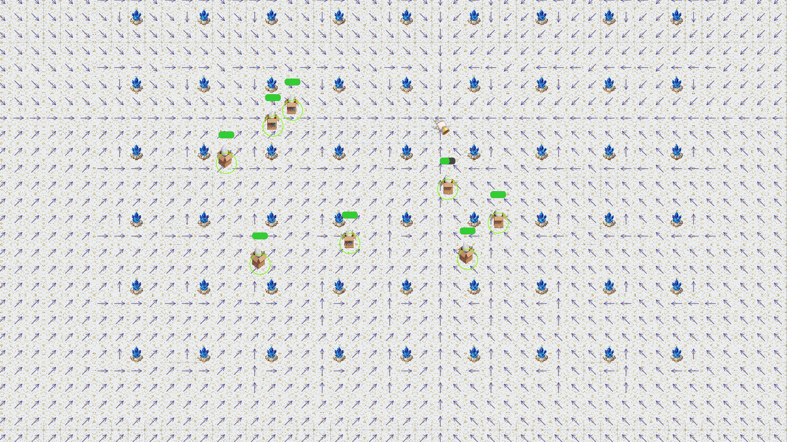

# StateOfHajimi

---

## 更新日志

### 2026/1/9

> 1.  优化避让检测系统逻辑，解决物体抖动问题
> 2.  添加网格地图系统以及渲染功能
> 3.  批量选中目标将进行列阵，使用反射为不同阵列注入不同列阵方法
> 4.  添加游戏相机，实现界面视角移动功能
> 5. 为鼠标添加状态机，鼠标事件触发时执行不同状态下的功能，目前有 Idle, Select, MapPanning 三种状态，具体实现尚未完成
> 6.  优化游戏输入逻辑处理部分，使用桥接器将客户端接收到的命令快照存储起来，在游戏逻辑部分集中执行

---

### 2026/1/10

> 1. 实现鼠标状态机与命令系统
> 2. 实现全局快捷键
> 3. 实现游戏画面缩放
> 4. 添加 Serilog 日志记录游戏信息

### 2026/1/11

> 1. 实现游戏工厂自动生产兵种
> 2. 实现兵种配置保存在 GameSettings.json 中，支持热重载
> 3. 添加材质管理器加载材质
> 4. 修复大型建筑避让出错问题

### 2026/1/12

> 1. 实现游戏单元行为树（Behavior Tree）
> 2. 实现动画系统，使用精灵图管理不同单元在不同状态下的动画
> 3. 初步实现实体的检索敌人、攻击系统
> 4. 添加工厂设置集结点功能

### 2026/1/16

> 1. 添加血条显示，碰撞箱显示
> 2. 重构渲染底层，将原始 Avalonia 渲染 context 替换成 SkiaSharp context，使用矩阵变换移动、缩放相机，提高效率。
> 3. 修复了实体死亡动画不播放、以及死亡后再生成闪退的 bug
> 4. 修复了选择框选择已选中的实体时会导致实体无法再次被选中的 bug

### 2026/1/19

> 1. 添加实体流场寻路逻辑，优化避让系统
> 2. 优化实体动画显示，现在能正确显示对应移动方向的动画
> 3. 优化选择逻辑，现在可以选中建筑显示集结点
> 4. 新添系统化建筑的构建

### 2026/1/20

> 1. 优化调试：流场寻路可视化
> 2. UI更新：新增自定义鼠标指针，包括默认，悬浮，攻击，选择集结点

### 2026/1/14

>1. 重构 GameCanvas，复用画布用于地图编辑器设计
>2. 分离渲染与数据处理逻辑，在 ECS CollectSystem 收集渲染数据，使用双缓冲将每一帧的渲染数据传递给 GameCanvas 的 Renderer 进行渲染， 渲染样式全部由 Renderer 定义
>3. 优化命令系统，前端通过桥接器 Bridge 发送游戏命令到 ECS CommandDispatcherSystem 进行批处理
>4. 序列化地图与实体信息，并添加地图存取功能
>5. 分离游戏资源、配置与客户端项目，便于编辑器复用