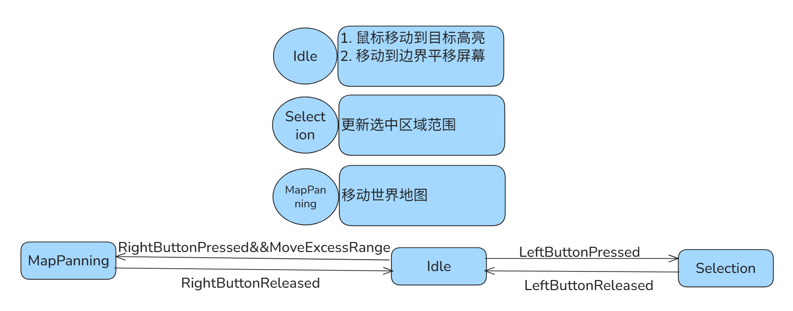

# StateOfHajimi

---

## 更新日志

### 2026/1/9

> 1.  优化避让检测系统逻辑，解决物体抖动问题
> 2.  添加网格地图系统以及渲染功能
> 3.  批量选中目标将进行列阵，使用反射为不同阵列注入不同列阵方法
> 4.  添加游戏相机，实现界面视角移动功能
> 5. 为鼠标添加状态机，鼠标事件触发时执行不同状态下的功能，目前有Idle,Select,MapPanning三种状态，具体实现尚未完成
> 6.  优化游戏输入逻辑处理部分，使用桥接器将客户端接收到的命令快照存储起来，在游戏逻辑部分集中执行

---

### 2026/1/10

> 1. 实现鼠标状态机与命令系统
> 2. 实现全局快捷键
> 3. 实现游戏画面缩放
> 4. 添加Serilog日志记录游戏信息

### 2026/1/11

> 1. 实现游戏工厂自动生产兵种
> 2. 实现兵种配置保存在GameSettings.json中，支持热重载
> 3. 添加材质管理器加载材质
> 4. 修复大型建筑避让出错问题

### 2026/1/12

> 1. 实现游戏单元行为树（Behavior Tree）
> 2. 实现动画系统，使用精灵图管理不同单元在不同状态下的动画
> 3. 初步实现实体的检索敌人、攻击系统
> 4. 添加工厂设置集结点功能